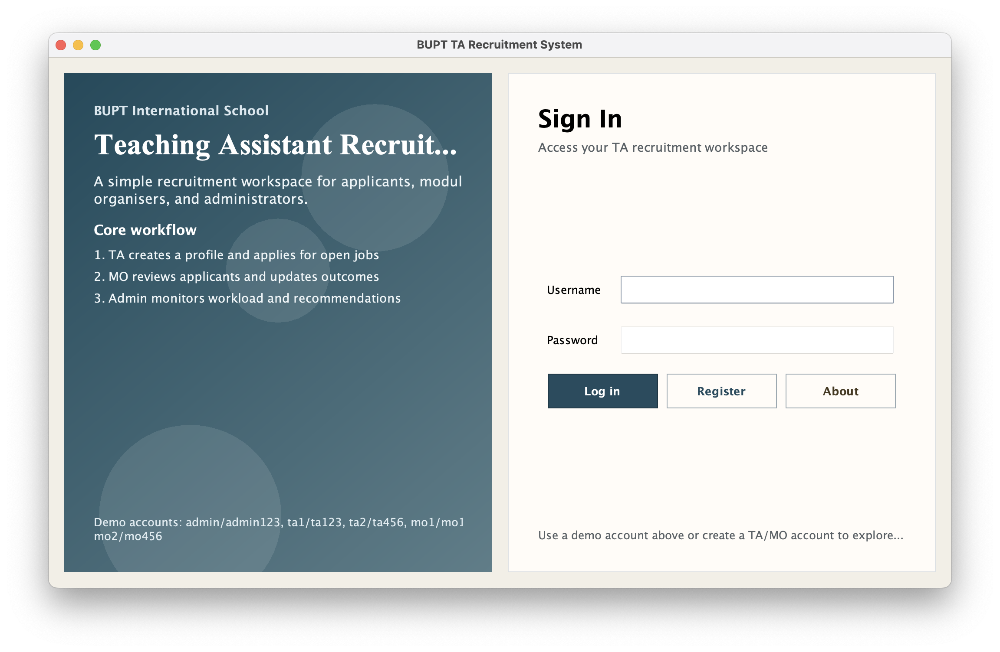
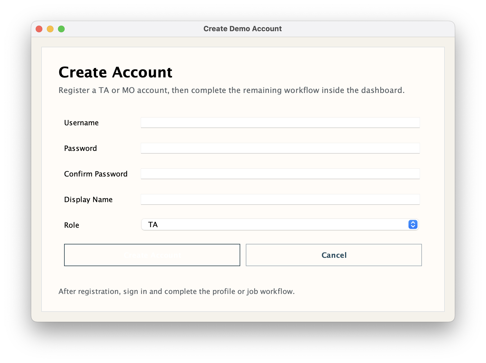
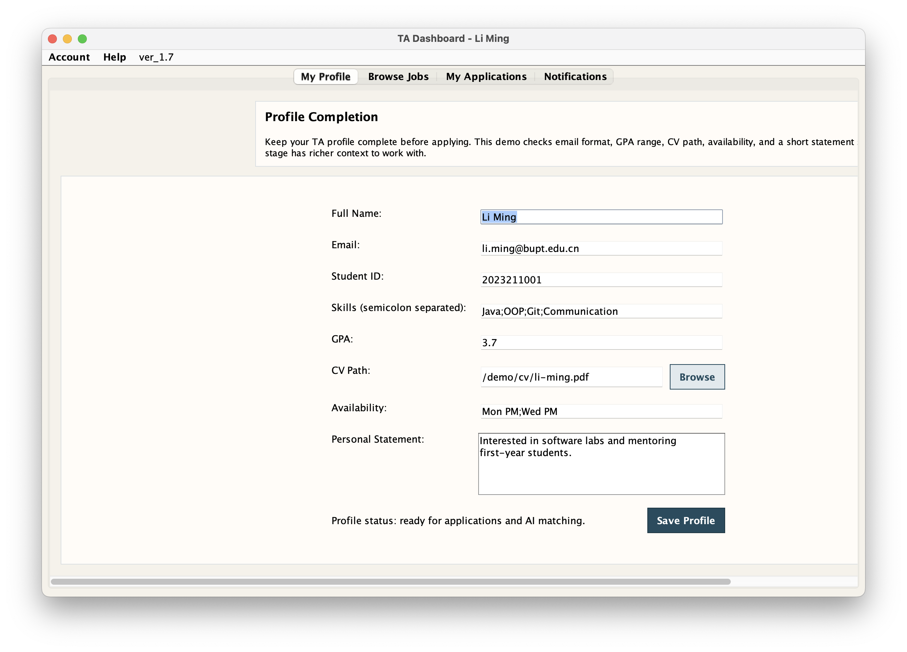
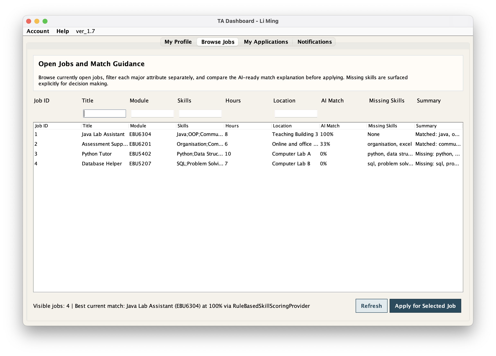
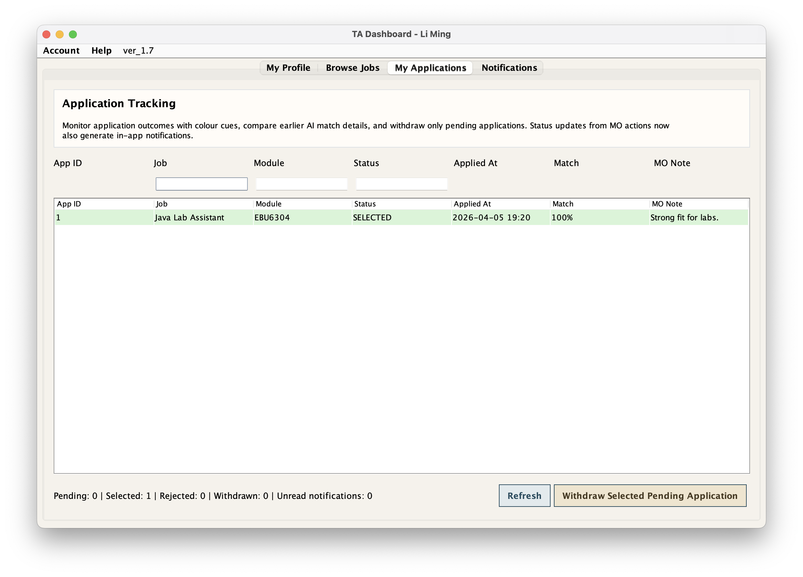
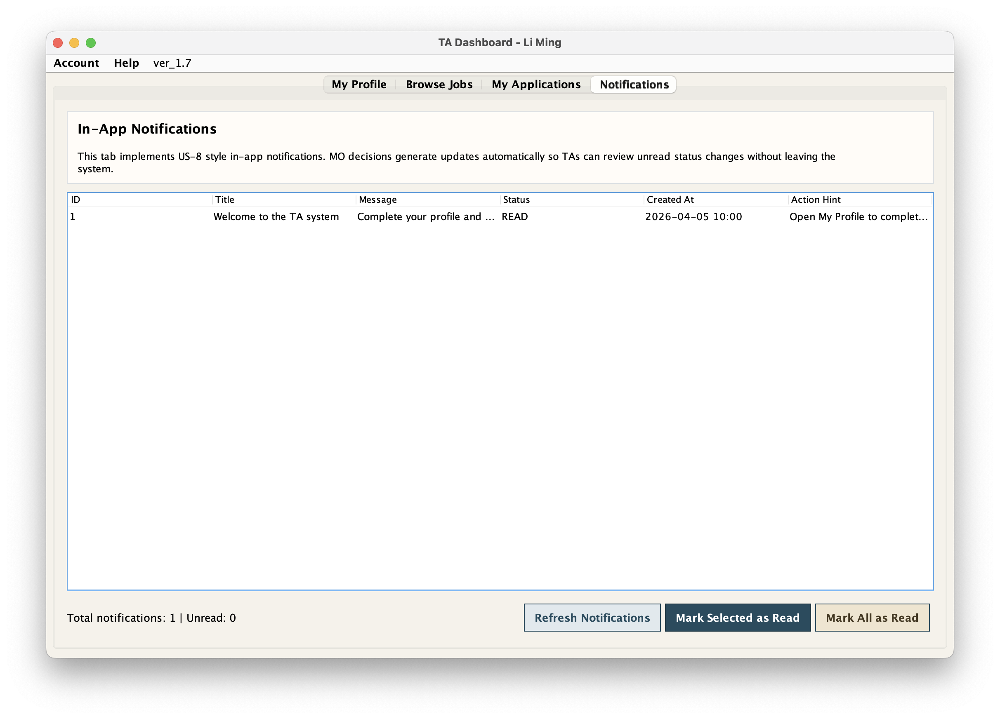
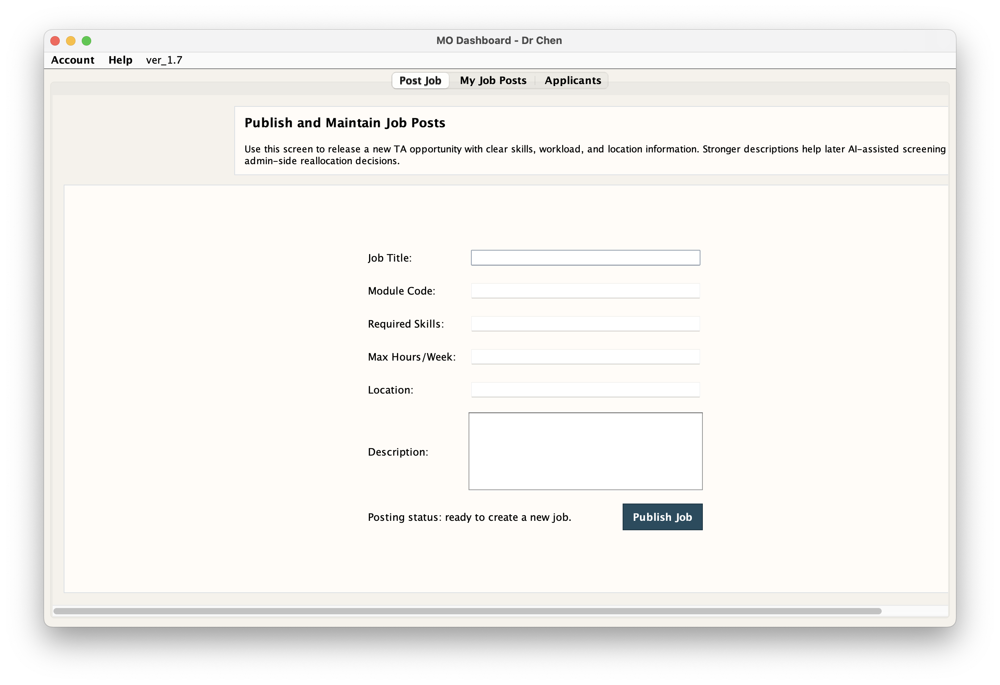
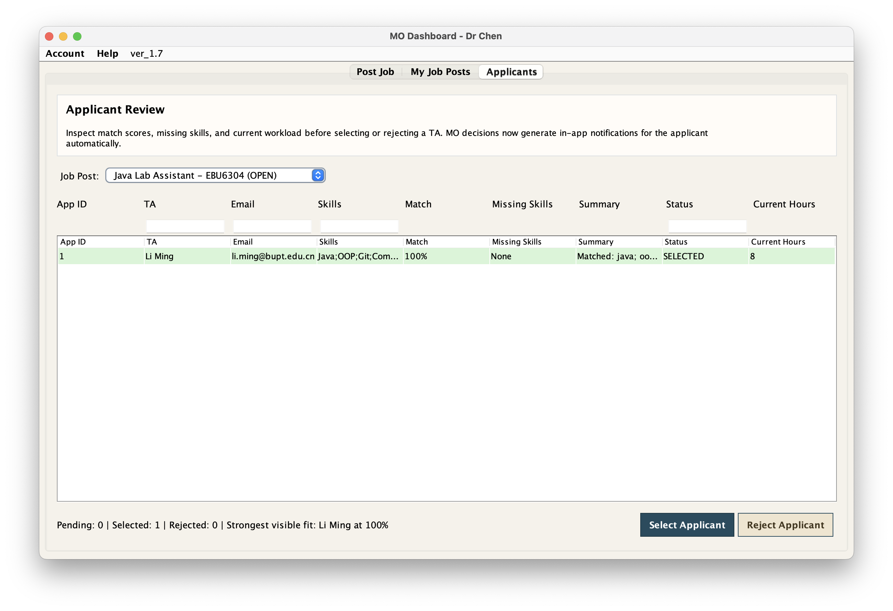
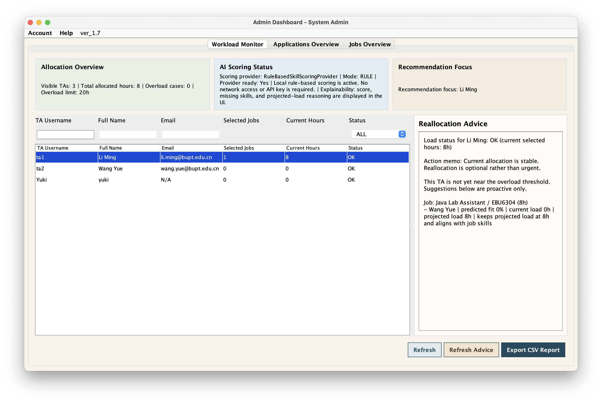
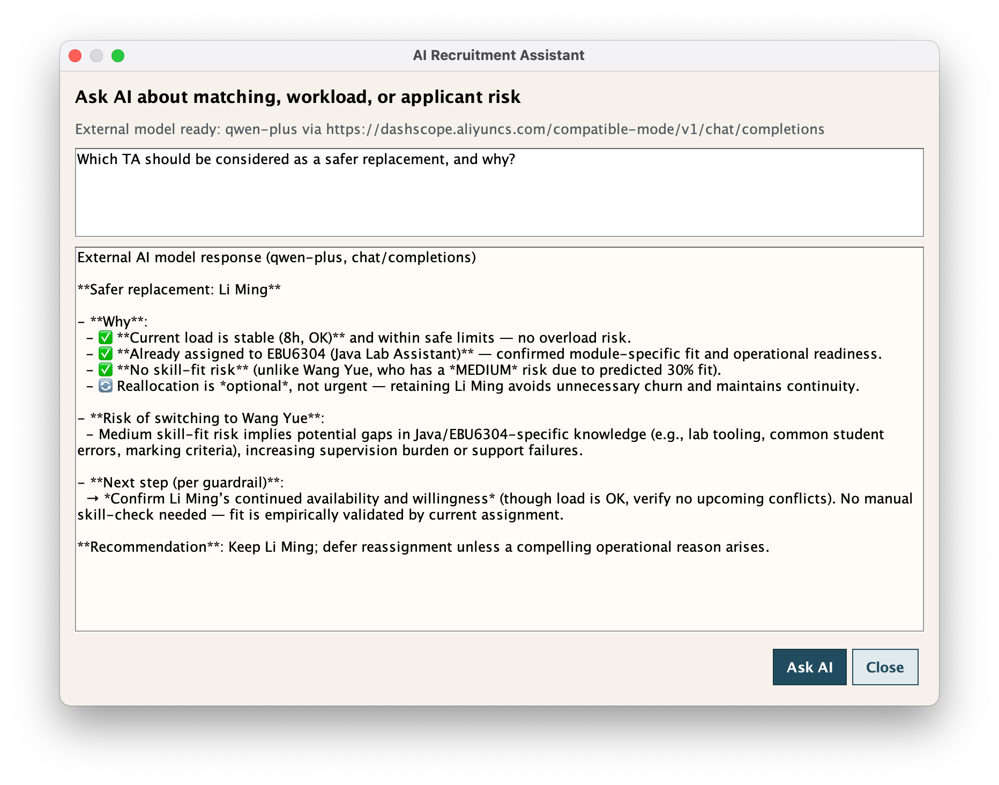

# EBU6304 Group 98 Demo Version 1.12

BUPT International School / QMUL Teaching Assistant Recruitment System.

This folder contains the stand-alone Java Swing demo for the EBU6304 group project. It implements a complete TA recruitment workflow for three roles: Teaching Assistant (TA), Module Organiser (MO), and Administrator (Admin).

## Final Submission Position

This `ver_1.0` folder is designed as a self-contained product-demo package. It follows the coursework constraints:

- stand-alone Java desktop application
- CSV text-file storage only
- no database
- role-based workflow for TA, MO, and Admin users
- explainable AI-assisted matching with an offline fallback path
- bilingual English / Chinese interface for BUPT and QMUL usage

The wider coursework still depends on the final report and Agile evidence, but this folder includes the runnable source code, CSV data, screenshots, test scripts, JavaDoc support, user-facing documentation, and viva preparation notes needed for a strong software demo submission.

## Latest Feature Scope

### TA Features

- Register or log in as a TA.
- Complete and edit a TA profile, including skills, GPA, availability, personal statement, and CV path.
- Browse open jobs with field-based search.
- View AI-assisted match scores and ranking explanations.
- Apply for selected jobs.
- Reapply to the same job after a previous application was `REJECTED` or `WITHDRAWN`.
- Track application status in `My Applications`.
- Withdraw only `PENDING` applications.
- Read notifications and messages through the top-right bell centre.
- Chat with the relevant MO after an application connects both sides.
- Send up to three messages before the MO approves the conversation.
- View reputation-related effects through future match scores.

### MO Features

- Register or log in as a Module Organiser.
- Post new TA job opportunities.
- Manage open and closed job posts.
- Review applicants for each job.
- View current match score, missing skills, profile details, TA reputation, and workload before deciding.
- Select or reject TA applications.
- Approve TA-MO conversations from the bell centre.
- Rate completed TA work after selection.
- Trigger a reputation penalty when a TA had a high original match score but receives a low completion rating.

### Admin Features

- Monitor all TA workloads.
- Detect workload risk through `OK`, `NEAR LIMIT`, and `OVERLOAD` states.
- View AI-style replacement and reallocation recommendations.
- Ask the AI Assistant about workload, replacement, and allocation risk.
- Edit global application records.
- Edit global job records.
- Export CSV workload reports.
- Inspect notifications and message alerts through the bell centre.

### Cross-Role Features

- English / Chinese UI switching from the login page and every dashboard.
- Top-right bell centre for notifications and TA-MO messages.
- Wrapping table cells so long titles, skills, locations, and summaries are readable without `...` truncation.
- Real-time current match scores in TA, MO, and Admin views, aligned with the right-side AI ranking panel.
- CSV-backed persistence for users, profiles, jobs, applications, notifications, messages, message consent, work evaluations, and TA reputation.

## Demo Accounts

| Role | Username | Password | Display Name |
| --- | --- | --- | --- |
| Admin | `admin` | `admin123` | System Admin |
| TA | `ta1` | `ta123` | Li Ming |
| TA | `ta2` | `ta456` | Wang Yue |
| MO | `mo1` | `mo123` | Dr Chen |
| MO | `mo2` | `mo456` | Prof Zhao |

Additional TA or MO accounts can be created from the registration screen.

## Quick Start

### Windows PowerShell

From this folder:

```powershell
javac -encoding UTF-8 -d bin src\*.java
java -cp bin Main
```

Run tests:

```powershell
javac -encoding UTF-8 -d bin src\*.java
java -cp bin SystemSmokeTest
java -cp bin AuthFlowTest
java -cp bin WorkflowRulesTest
java -cp bin CsvPersistenceTest
java -cp bin PostWorkFeedbackAndMessagingTest
```

### macOS / Linux

Compile:

```bash
sh compile.sh
```

Run:

```bash
sh run.sh
```

Run all lightweight regression tests:

```bash
sh test.sh
```

### Generate JavaDocs

```bash
sh javadoc.sh
```

Generated output is written to `javadocs/`.

## Recommended Demo Flow

1. Open the application and switch between `English` and `中文`.
2. Log in as `ta1 / ta123`.
3. Open `My Profile`, complete profile fields, and save.
4. Open `Browse Jobs`, search by title or skill, review the AI match ranking, select a job, and apply.
5. Open `My Applications` to confirm the new `PENDING` application.
6. Open the bell centre, send TA-MO messages, and observe the three-message pre-approval limit.
7. Log in as the relevant MO, open the bell centre, and approve the conversation.
8. Use the MO dashboard to post a job, manage job posts, review applicants, select or reject applications, and rate completed work.
9. Log in as Admin to monitor workload, inspect AI recommendations, edit application/job records, and export a CSV report.
10. Return to the TA account to view notifications and updated application state.

## Matching and Ranking Behaviour

The matching score is calculated through the active `ScoringService`.

In offline mode, the local rule-based scorer:

1. Splits the TA skills and job required skills into normalized skill tokens.
2. Counts required skills matched by the TA profile.
3. Computes `matched required skills / total required skills * 100`.
4. Applies any TA reputation penalty to the current display score.
5. Produces a readable summary showing matched and missing skills.

The TA, MO, and Admin dashboards now display current real-time match scores. This keeps the left-side tables consistent with the right-side AI ranking panels. The stored `matchScore` in `applications.csv` is retained as an application-time historical record and is also used by the post-work reputation mechanism.

## Message Consent Rule

TA-MO messaging is intentionally limited before consent:

- TA and MO contacts appear when an application connects both sides.
- Before conversation approval, one sender can send at most three messages to the other side for that job.
- Only the MO who owns the job can approve the conversation.
- After approval, the three-message limit is lifted for that TA-MO-job conversation.
- The bell centre clearly shows whether the conversation is approved or still waiting for MO approval.

## Reputation and Post-Work Evaluation

MO users can rate completed work for selected TA applications.

The reputation mechanism works as follows:

- Each TA starts with a default reputation score of `100`.
- If an application had a high original match score but the MO gives a low final work rating, the TA receives a reputation penalty.
- The reputation penalty reduces future current match scores.
- The system treats this as a skill-reliability signal, not an automatic misconduct decision.

This allows the demo to explain why a candidate with strong claimed skills may be ranked lower in future matching after poor delivery.

## AI Configuration

### Offline demo mode

No external key is required. If no live AI configuration is available, the application uses local explainable rule-based matching and local fallback guidance.

### Optional live `qwen-plus` mode

Copy the example file and keep the real key local:

```bash
cp config/ai.properties.example config/ai.properties
```

Then edit `config/ai.properties` with your own values. The real local config file is ignored by Git.

Equivalent environment-variable setup:

```bash
export OPENAI_API_KEY=your_bailian_key_here
export OPENAI_MODEL=qwen-plus
export OPENAI_BASE_URL=https://dashscope.aliyuncs.com/compatible-mode/v1
export AI_API_MODE=CHAT_COMPLETIONS
export AI_SCORING_MODE=AI
```

When configured, the AI Assistant can call the compatible chat-completions endpoint. If the model is unavailable or the key is missing, the system remains usable through the local fallback path.

## CSV Storage

All persistent data is stored in CSV files under `data/`:

- `users.csv`
- `profiles.csv`
- `jobs.csv`
- `applications.csv`
- `notifications.csv`
- `messages.csv`
- `message_consents.csv`
- `work_evaluations.csv`
- `ta_reputations.csv`
- exported `admin_workload_report_*.csv`

No database or external persistence framework is used.

## Project Layout

- `src/`: Java source code
- `data/`: CSV data files used by the demo
- `config/ai.properties.example`: local AI configuration template
- `docs/architecture.md`: structure overview
- `docs/task_plan_alignment.md`: requirement and task-plan comparison notes
- `docs/final_requirement_checklist.md`: requirement-to-evidence mapping
- `docs/testing_strategy.md`: test strategy and workflow coverage
- `docs/user_manual.md`: final user manual with screenshot references
- `docs/ta_recruitment_viva_notes_zh.pdf`: Chinese viva preparation notes
- `screenshots/`: demo screenshots used by the manual and README
- `compile.sh`: compile script
- `run.sh`: GUI launch script
- `test.sh`: lightweight regression-test script
- `javadoc.sh`: JavaDoc generation script

Generated files such as `bin/`, `*.class`, local AI keys, JavaDocs, and exported workload reports should not be committed.

## Regression Tests

The test suite currently includes:

- `SystemSmokeTest`
- `AuthFlowTest`
- `WorkflowRulesTest`
- `CsvPersistenceTest`
- `PostWorkFeedbackAndMessagingTest`

The last test covers the newer reputation penalty and message-consent behaviour.

## Product Screenshots

### Login and Registration





### TA Workflow









### MO Workflow





### Admin Workflow





## Version Notes

- `ver_1.0`: first complete integrated demo build
- `ver_1.1`: usability-focused iteration with filtering and improved admin monitoring feedback
- `ver_1.2`: task-plan alignment update with shared dashboard base and stronger L2 authentication checks
- `ver_1.3`: stronger admin operations and AI-ready scoring abstraction
- `ver_1.4`: live AI placeholder path, admin reallocation recommendations, and UI polish
- `ver_1.5`: macOS-friendly entry screens and stronger final-demo usability
- `ver_1.6`: CSV-backed notifications and aligned multi-field search across key tables
- `ver_1.7`: expanded US-8 triggers with profile-completion reminders and job-closure alerts
- `ver_1.8`: cross-platform UI fixes, compact attribute search, and interactive AI assistant dialog
- `ver_1.9`: Admin AI Assistant supports real external model calls, including qwen-plus via DashScope compatible chat completions
- `ver_1.10`: qwen-plus local config support, plain-text AI prompt rules, copy response action, lightweight regression tests, JavaDoc generation support, and final-delivery documentation
- `ver_1.11`: faster search and page-refresh behaviour, explicit Search actions for filter toolbars, lighter refresh feedback, and reduced repeated CSV reads across TA, MO, and Admin dashboards
- `ver_1.12`: bilingual UI, bell-centre notifications and messages, MO-only conversation approval, three-message pre-approval rule, post-work ratings, TA reputation penalties, rejected-application reapply support, wrapping table cells, and real-time match/ranking consistency
