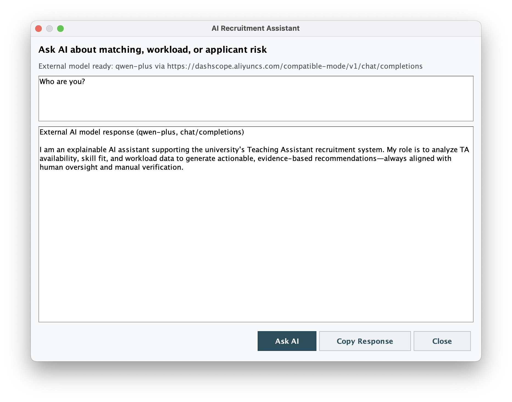
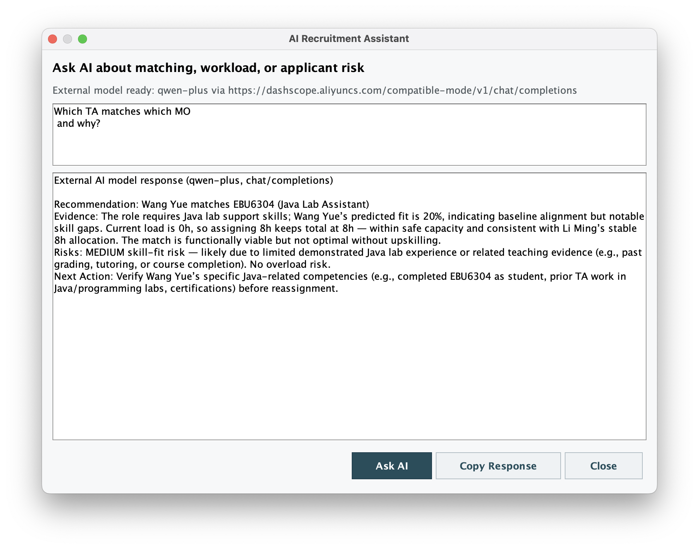

# EBU6304 Group 98 Demo Version 1.10

BUPT International School Teaching Assistant Recruitment System.

## Final Submission Position

This `ver_1.0` folder is a stand-alone Java Swing demo that focuses on the selected set of core recruitment features required by the coursework brief. It stays within the mandatory coursework constraints:

- stand-alone Java application
- CSV text-file storage only
- no database
- explainable AI-assisted features with an offline fallback path

The wider coursework still depends on repository-level Agile evidence and the final report, but this folder now includes the code, test scripts, JavaDoc generation support, user manual, screenshots, and requirement-check documents needed for a strong product-demo submission package.

## Product Scope

This demo implements the core recruitment workflow:

- TA can create and edit an applicant profile
- TA can browse open jobs and apply for them
- TA can check application status and withdraw pending applications
- TA can receive in-app notifications about application decisions, missing profile details, and closed jobs
- MO can post jobs, manage their own posts, and review applicants
- Admin can monitor TA workload, edit global application and job records, export reports, and inspect replacement recommendations
- AI-assisted scoring is included through an explainable rule-based engine and an optional external model provider

## Final Submission Checklist

- [x] stand-alone Java application
- [x] CSV-based persistence with no database
- [x] TA / MO / Admin core workflow
- [x] in-app notification support for key recruitment events
- [x] explainable AI-assisted matching and admin recommendation support
- [x] setup and run instructions
- [x] lightweight automated regression tests
- [x] JavaDoc generation script
- [x] user manual with screenshot references
- [x] requirement checklist and testing strategy documents

## Demo Accounts

- `admin / admin123`
- `ta1 / ta123`
- `ta2 / ta456`
- `mo1 / mo123`
- `mo2 / mo456`

## Build, Run, and Test

### Compile

```bash
./compile.sh
```

### Run the desktop application

```bash
./run.sh
```

### Run the lightweight regression tests

```bash
./test.sh
```

The test script compiles the project and runs:

- `SystemSmokeTest`
- `AuthFlowTest`
- `WorkflowRulesTest`
- `CsvPersistenceTest`

### Generate JavaDocs

```bash
./javadoc.sh
```

Generated output will be written to `javadocs/`.

## AI Configuration

### Offline demo mode

No external key is required for the core workflow. When no live configuration is available, the project falls back to local explainable rule-based matching so the demo remains usable offline.

### Optional live `qwen-plus` mode

Copy the example file and keep the real key local:

```bash
cp config/ai.properties.example config/ai.properties
```

Then edit `config/ai.properties` with your own values. The real local config file is ignored by Git.

Equivalent environment-variable setup:

```bash
export OPENAI_API_KEY=your_bailian_key_here
export OPENAI_MODEL=qwen-plus
export OPENAI_BASE_URL=https://dashscope.aliyuncs.com/compatible-mode/v1
export AI_API_MODE=CHAT_COMPLETIONS
export AI_SCORING_MODE=AI
```

When configured, the Admin AI Assistant can call the compatible chat-completions endpoint. If the model is unavailable or the key is missing, the system still exposes local explainable guidance through the rule-based scoring path.

## Storage Constraint

All persistent input/output data remain in CSV files under `data/`:

- `users.csv`
- `profiles.csv`
- `jobs.csv`
- `applications.csv`
- `notifications.csv`
- exported `admin_workload_report_*.csv`

No database or external persistence framework is used.

## Project Layout

- `src/`: Java source code
- `data/`: CSV data files used by the demo
- `config/ai.properties.example`: local AI configuration template
- `docs/architecture.md`: structure overview
- `docs/task_plan_alignment.md`: requirement and task-plan comparison notes
- `docs/final_requirement_checklist.md`: requirement-to-evidence mapping
- `docs/testing_strategy.md`: test strategy and workflow coverage
- `docs/user_manual.md`: final user manual with screenshot references
- `screenshots/`: demo screenshots used by the manual and README
- `compile.sh`: compile script
- `run.sh`: GUI launch script
- `test.sh`: lightweight regression-test script
- `javadoc.sh`: JavaDoc generation script

## Product Screenshots

### Login and Registration


### TA Workflow


### MO Workflow


### Admin Workflow


### AI Recommendations






## Final-Delivery Documents

- `docs/final_requirement_checklist.md`
- `docs/testing_strategy.md`
- `docs/user_manual.md`
- `docs/architecture.md`
- `docs/task_plan_alignment.md`

## Version Notes

- `ver_1.0`: first complete integrated demo build
- `ver_1.1`: usability-focused iteration with filtering and improved admin monitoring feedback
- `ver_1.2`: task-plan alignment update with shared dashboard base and stronger L2 authentication checks
- `ver_1.3`: stronger admin operations and AI-ready scoring abstraction
- `ver_1.4`: live AI placeholder path, admin reallocation recommendations, and UI polish
- `ver_1.5`: macOS-friendly entry screens and stronger final-demo usability
- `ver_1.6`: CSV-backed notifications and aligned multi-field search across key tables
- `ver_1.7`: expanded US-8 triggers with profile-completion reminders and job-closure alerts
- `ver_1.8`: cross-platform UI fixes, compact attribute search, and interactive AI assistant dialog
- `ver_1.9`: Admin AI Assistant supports real external model calls, including qwen-plus via DashScope compatible chat completions
- `ver_1.10`: qwen-plus local config support, plain-text AI prompt rules, copy response action, lightweight regression tests, JavaDoc generation support, and final-delivery documentation
